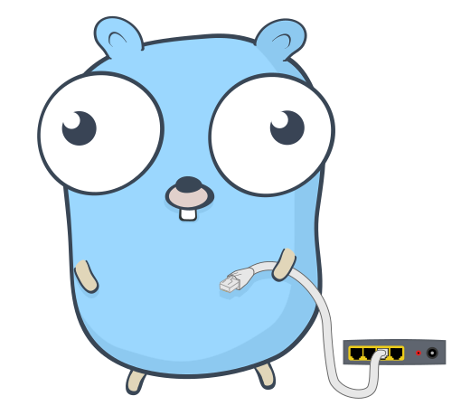

<p align="center">
  
</p>

# go-webserver

A simple, lightweight web server built with Go.

# Features
- [x] Supports GET, POST, PUT, DELETE, and OPTIONS requests
- [ ] Supports JSON and HTML responses
- [x] Supports custom routes
- [ ] Customizable error pages
- [ ] Support for static files

# Getting Started
To start using go-webserver, simply install the package and import it into your Go project:

`go get github.com/sebastianmarines/go-webserver`

Then, import the package and create a new server:

```go
package main

import web "github.com/sebastianmarines/go-webserver"

func main() {
	server := web.NewWebserver()
	server.AddRoute("/", func(request web.Request) web.Response {
		return web.Response{
			StatusCode: 200,
			Headers: map[string]string{
				"Content-Type": "text/html",
			},
			Body: "<h1>Hello world!</h1>",
		}
	})
	server.Start(":8080")
}
```

# Contributing
If you would like to contribute to go-webserver, please fork the repository and submit a pull request.

# License
go-webserver is licensed under the MIT License.
